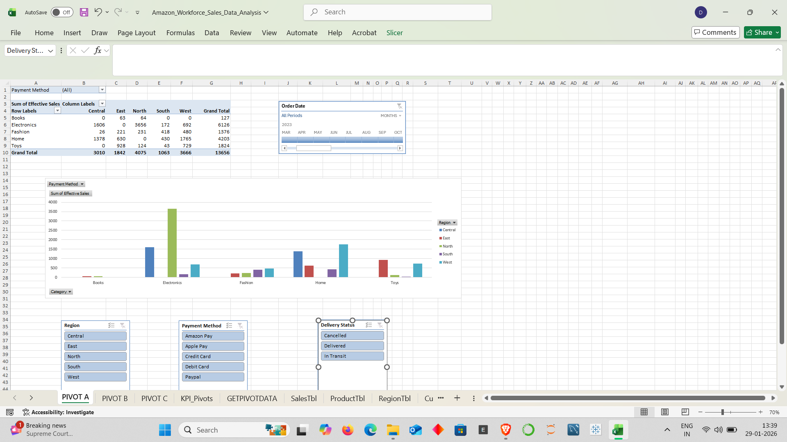

# Data-Analytics-Portfolio
Hi, I'm Dishant Jain!  Welcome to my Data Analytics Portfolio. I am a Engineering graduate transitioning to Data Analytics. This portfolio showcases projects using SQL, Python, Power BI, and Tableau. Includes work on Sales Dashboards, Exploratory Data Analysis (EDA), and Database Management. Passionate about deriving business insights from data.
1.COVID-19 Global Dashboard (Excel)
* Project Type: Data Cleaning & Diagnostic Analysis.
* Objective: To analyze the spread of COVID-19 across WHO Regions and identify high-impact zones.
* Tools Used: Advanced Excel (Pivot Tables, Conditional Formatting, Data Cleaning).
* Key Actions Performed:
    * Data Cleaning: Processed raw global data to remove duplicates and handle null values.
    * Aggregation: Created Pivot Tables to summarize `Confirmed Cases`, `Deaths`, and `Recovered` stats by Country and WHO Region.
    * Visualization: Built a dashboard to highlight regions with the highest infection rates.
* Files:[View Excel File](COVID-19 Global Dashboard.xlsx)

### 2. 📦 Amazon Workforce Sales Analysis (Excel)
* Project Type: Data Modeling & KPI Reporting.
* Objective: To analyze sales performance, delivery efficiency, and regional trends using a relational dataset.
* Tools Used: Excel Data Modeling (Power Pivot), GETPIVOTDATA, Pivot Charts.
* *Key Actions Performed:*
    * Data Modeling: Connected multiple dimension tables (`ProductTbl`, `RegionTbl`, `CustomerTbl`) to the main `SalesTbl` using relationships (Star Schema).
    * Advanced Reporting: Used `GETPIVOTDATA` to extract specific metrics for dynamic KPI cards.
    * Analysis: Calculated total revenue ($14.5M) and analyzed "Average Delivery Days" by region.
* **Files:** [View Excel File](Amazon_Workforce_Sales_Data_Analysis.xlsx)

