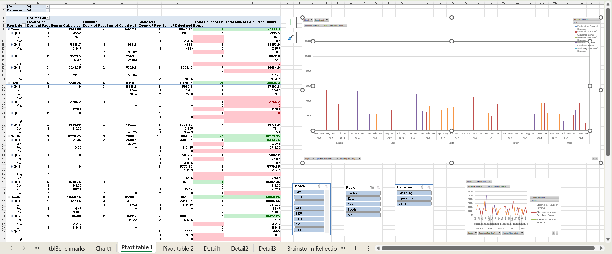
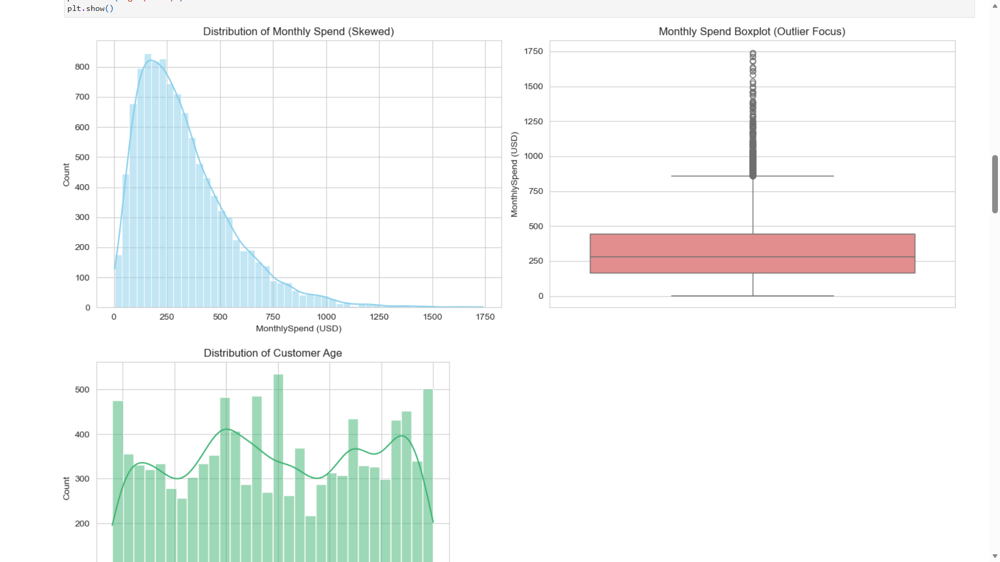
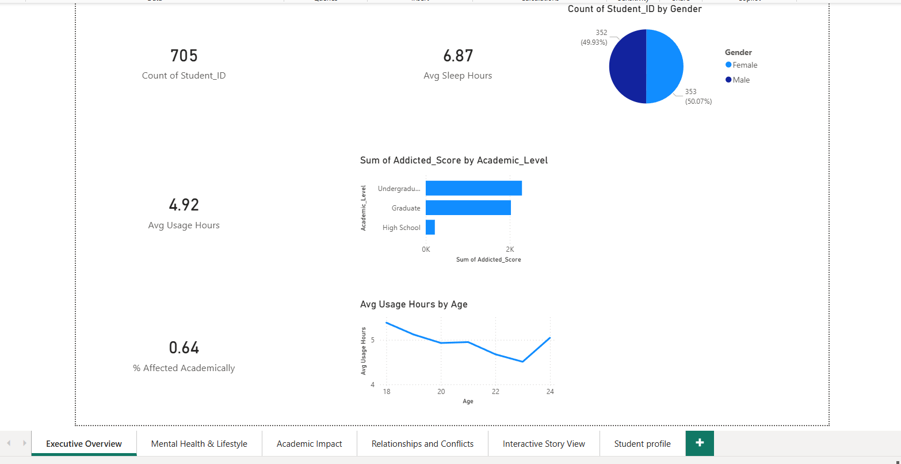
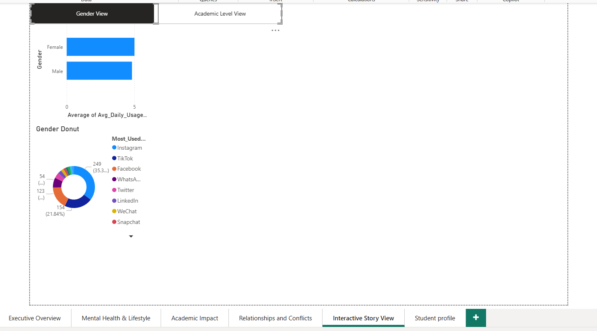
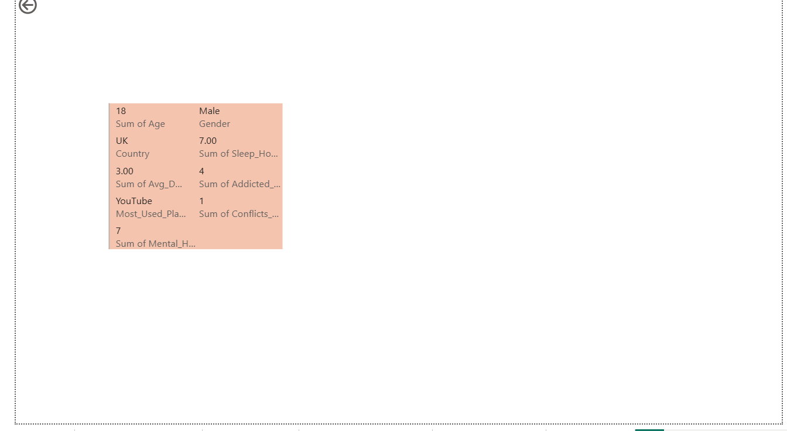

# Data-Analytics-Portfolio
Hi, I'm Dishant Jain!  Welcome to my Data Analytics Portfolio. I am a Engineering graduate transitioning to Data Analytics. This portfolio showcases projects using SQL, Python, Power BI, and Tableau. Includes work on Sales Dashboards, Exploratory Data Analysis (EDA), and Database Management. Passionate about deriving business insights from data.

### 1.COVID-19 Global Dashboard (Excel)
* Project Type: Data Cleaning & Diagnostic Analysis.
* Objective: To analyze the spread of COVID-19 across WHO Regions and identify high-impact zones.
* Tools Used: Advanced Excel (Pivot Tables, Conditional Formatting, Data Cleaning).
* Key Actions Performed:
    * Data Cleaning: Processed raw global data to remove duplicates and handle null values.
    * Aggregation: Created Pivot Tables to summarize `Confirmed Cases`, `Deaths`, and `Recovered` stats by Country and WHO Region.
    * Visualization: Built a dashboard to highlight regions with the highest infection rates.
* Files:[View Excel File](COVID-19 Global Dashboard.xlsx)

### 2. 📦 Amazon Workforce Sales Analysis (Excel)
* Project Type: Data Modeling & KPI Reporting.
* Objective: To analyze sales performance, delivery efficiency, and regional trends using a relational dataset.
* Tools Used: Excel Data Modeling (Power Pivot), GETPIVOTDATA, Pivot Charts.
* *Key Actions Performed:*
    * Data Modeling: Connected multiple dimension tables (`ProductTbl`, `RegionTbl`, `CustomerTbl`) to the main `SalesTbl` using relationships (Star Schema).
    * Advanced Reporting: Used `GETPIVOTDATA` to extract specific metrics for dynamic KPI cards.
    * Analysis: Calculated total revenue ($14.5M) and analyzed "Average Delivery Days" by region.
* **Files:** [View Excel File](Amazon_Workforce_Sales_Data_Analysis.xlsx)

### 3. 👥 Workforce & Sales Intelligence Dashboard (Excel)
* Project Type: HR & Sales Performance Analytics.
* Objective: To merge employee data with sales records to evaluate workforce performance against benchmarks.
* Tools Used: XLOOKUP (for data merging), Pivot Tables, Slicers, Conditional Formatting.
* *Key Actions Performed:*
    * Data Integration: Used **XLOOKUP** to merge disparate datasets (`tblEmployees` and `tblSales`) to map sales figures to specific departments and roles.
    * Performance Benchmarking: Compared individual employee sales against standardized `tblBenchmarks` to calculate performance ratings.
    * Interactive Reporting:Built a dynamic dashboard with **Slicers** to filter performance data by Department and Region instantly.
* **Files:** [View Excel File](Workforce_Sales_Dashboard.xlsx)

### 4.Project: CoffeeConnect Café Chain Analysis 
Tools: Python, Pandas, Seaborn. 
Goal: Analyzed 2 months of transaction data to assist with inventory, staffing, and expansion decisions.
Key Insights: Identified peak operational hours, calculated month-over-month revenue growth, and determined the most popular payment methods.

### 5. 💊 Pharmacy Inventory Database (SQL)
* Project Type: Relational Database Design & Querying.
* Objective: To design a normalized database schema for a pharmacy to track inventory, suppliers, and sales.
* Tools Used: MySQL, DDL/DML Commands, Joins, Subqueries.
* **Key Actions Performed:**
    * Schema Design: Created a relational schema with 4 tables (`Medicines`, `Suppliers`, `Purchases`, `Sales`) using Primary and Foreign Keys.
    * Complex Queries: Wrote SQL queries to identify expiring stock, calculate total revenue per medicine, and track supplier performance.
    * Data Integrity: Implemented constraints to ensure accurate data entry.
* **Files:** * [View SQL Code](Pharmacy_Queries.sql)
    * [View Execution Results & Screenshots (PDF)](SQL_Project_Results.pdf)
 
### Project: Statistical Problem Solving for Business 
* Tools: Descriptive Statistics, Hypothesis Testing, Probability Distributions.
* Goal: Applied statistical concepts to solve real-world business scenarios. 
* Topics Covered: Central Tendency, Measures of Dispersion, A/B Testing (Hypothesis Testing), and Sampling Techniques.

### 6. 🧪 Customer Insights: A Statistical Investigation (Python)
* Project Type: Statistical Analysis & Hypothesis Testing.
* Objective: To validate business assumptions about customer behavior using rigorous statistical methods.
* Tools Used: Python (Pandas, Scipy, Statsmodels), Matplotlib, Seaborn.
* **Key Statistical Tests:**
    * T-Test: Tested if there is a significant spending difference between genders (Null Hypothesis rejected/accepted).
    * ANOVA: Analyzed if `Education Level` impacts `Monthly Spend`.
    * Chi-Square: Examined the relationship between `Marital Status` and `Pet Ownership`.
* **Business Insight:** Identified key demographic segments (e.g., Master's degree holders) with significantly higher interaction rates to target for marketing campaigns.
* **Files:** [View Analysis Notebook](Customer_Insights_Analysis.ipynb)

### 7. 🛍️ Retail Store Database Analysis (SQL)
* Project Type: Relational Database Management & Business Analysis.
* Objective: To build a normalized retail database and analyze sales performance, inventory, and customer behavior.
* Tools Used: SQL (Joins, Subqueries, Aggregations, DDL/DML).
* Database Schema:Designed 6 relational tables: `Customers`, `Products`, `Orders`, `Order_Items`, `Payments`, and `Reviews`.
* **Key Analysis Performed:**
    * Revenue Analysis: Calculated total revenue, average order value, and top-performing product categories.
    * Customer Segmentation: Identified active vs. inactive customers and high-value clients using Subqueries.
    * Inventory Management: Identified out-of-stock products and low-inventory alerts.
* **Files:**
    * [View Analysis Report & Outcomes (PDF)](Retail_Store_Analysis_Report.pdf)
    * [View Database Setup Code](Retail_Store_Schema_and_Data.sql)
 
  ### 5. 📊 Student Lifestyle & Well-being Analysis (Power BI)
* Project Type: Interactive Dashboard & Data Storytelling.
* Objective: To analyze the correlation between social media usage and students' sleep patterns, academic performance, and mental health.
* Tools Used: Power BI, DAX, Power Query.
* **Key Technical Features:**
    * Data Modeling: Built a **Star Schema** with a 1:1 relationship between `Student Details` and `Platform Details` tables.
    * Advanced Interactivity: Implemented **Bookmarks & Selection Panes** to toggle between "Gender View" and "Academic View".
    * Drill-Through: Created a dedicated profile page to drill down into individual student metrics from the main report.
    * DAX Measures: Calculated complex metrics like `% Affected Academically` and `Addicted Student Count` using `CALCULATE` and `DIVIDE`.
* **Files:** [Download Dashboard File](Student_Lifestyle_Dashboard.pbix)

### Dashboard Previews:
**1. Executive Overview:**

**2. Interactive Bookmark View:**

**3. Student Detail Drill-Through:**

